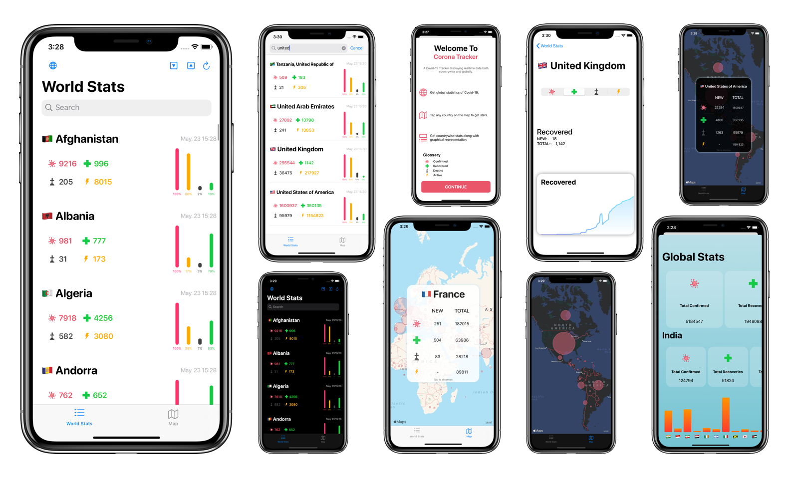

 

       
 

#### A Covid-19 Tracking Application made using Swift and SwiftUI

## Overview 🦠
- This app fetches realtime data of the corona virus and stores it locally.
- Data can be sorted based on user choice.
- circular overlays, line graphs and bar charts included for insight.

## Screenshots 📷
 

       
 

 
 ## Installation 🛠
 - Clone / download this repository.
 - change the bundle identifier in project settings.
 - run the app.
 
 ## How to Use?
 #### HomeViewController ( the first screen of app )
 - Read the onboarding screen to understand symbols provided.
 - Search any country's name in searchbar or scroll through.
 - Tap on any country for better insight.
 - Tap on sort buttons (🔼 or 🔽) for choice of sort.
 - Hit reload to update ( ↺ )
 - Or just pull to refresh.

 #### MapViewController ( the second tab )
 - Scroll / pinch / drag the map to explore.
 - Tap on any country to get stats. ( requires an active internet connection )
 - tap again to dissmiss.
 - Radius of circle on a country roughly estimates the number of cases in country.
 
 #### GlobeViewController ( tapping the globe icon on top left )
 - Shows global stats on top row.
 - Scroll to see more.
 - Bottom of screen has a bar chart consisting of all countries.
 - scroll the chart and tap any country to know more.
 
 #### YOU'RE GOOD TO GO 👍🏻
 
## Includes
- TableView
- MapView
- SwiftUI
- CoreData
- Networking
- Animations

 
## Author
* [Aaryan Kothari](https://github.com/aaryankotharii)

## Credits
- Corona virus Data :-  [covid19api](https://covid19api.com)
- SwiftUI Line Graph :-   [AppPear](https://github.com/AppPear/ChartView)
